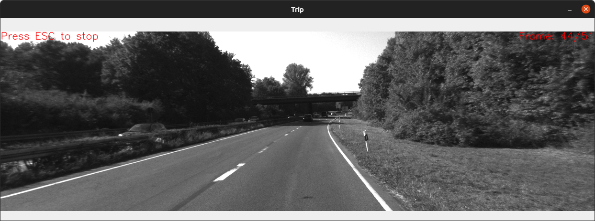
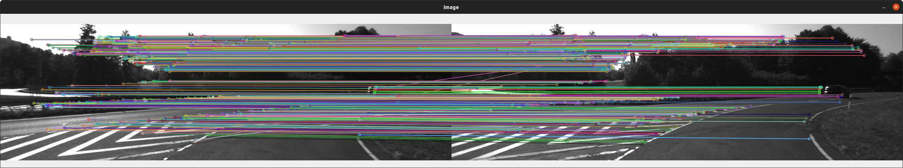
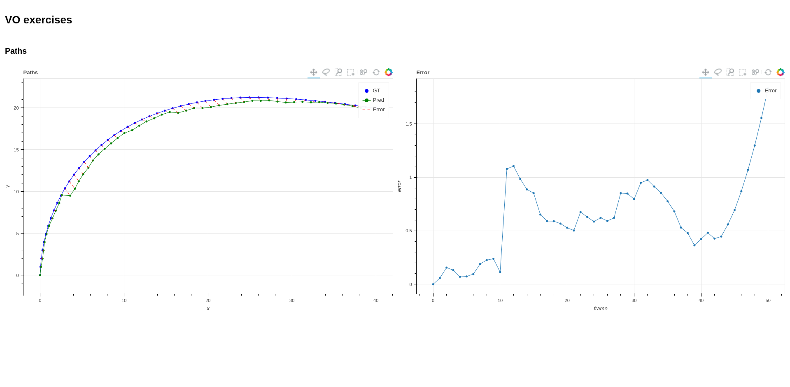

# visual-odometry
source: https://www.youtube.com/watch?v=N451VeA8XRA


## Requirements
```
opencv-python
opencv-contrib-python
bokeh
panel
scikit-learn
matplotlib
scipy
```

## How to run:
```
python visual_odometri.py
```

## Result
### Frame Sample

### Triangulated Result

### Localization Plot and error plot
